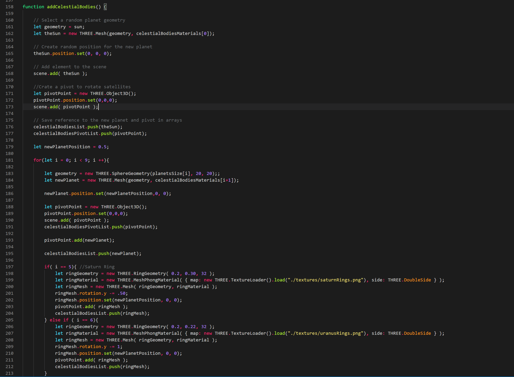

# Tarea 2. Sistema solar - Raziel Martínez

## Descripción
Utilizando WebGL dibuja lo siguiente: 
1. Crea 8 planetas (y plutón), con sus respectivas lunas, el sun, y el cinturón de asteroides.
2. Los astros se pueden crear como esferas.
3. Los planetas y lunas tienen que tener su propia rotación.
4. Las lunas tienen que rotar al rededor de los planetas, y los planetas tienen que rotar al rededor del sol.
5. Dibuja las orbitas de cada planeta.
6. Cada elemento tiene que tener su propio materia, con texturas, normales, y bump maps (de existir).
7. Investiga cómo funciona el orbit controller de three.js e integralo en la escena.

## Desarrollo

### Creación de astros
Para la creación de los astros utilicé geometrías de esferas ajustando el tamaño. No hice los tamaños a escala pero los acomodé de manera que los tamaños tuvieran sentido, por ejemplo, que se viera la diferencia
entre los planetas más grandes y los chicos, que las lunas estuvieran más chicas que los planetas pero más grandes que los asteroides, etc. La creación de todos los astros se hace al cargar la página. A la vez que se crean los astros también les coloqué un materialy pivotes pero eso será explicado más adelante en este README. 
 
Los astros que fueron creados son: 
- Sol (el astro más grande).
- 8 planetas y Plutón (Cada uno de diferente tamaño), Saturno y Urano con un anillo el cual simula varios con una textura cada uno.
- Las lunas de cada planeta (si es que tienen), la cantidad de lunas no fue la misma a las reales en todos los planetas pero se colocaron de manera que hiciera sentido. Estas lunas se generar en un radio aleatorio alrededor de su planeta respectivo.
- 400 asteroides (los astros más pequeños en ete ejercicio), que se crean en un radio aleatorio alrededor del Sol y distancia aleatoria dentro de la órbita correspondiente. 
#### Geometries
  
#### Add Sun, Planets

#### Add Moons
  
#### Add Asteoid Belt
  

### Texturas de astros
A cada planeta, sol, lunas, asteroides y órbitas se les colocó una textura.  A 2 planetas se les colocó un normal map y a 5 un bump map ya que estos fueron los únicos encontrados en Internet. 
Las texturas y maps fueron obtenidos de las siguientes referencias: https://www.solarsystemscope.com/textures/ y http://planetpixelemporium.com/earth.html. 

### Traslaciones y rotaciones
Funcionan de esta manera; los planetas giran alrededor del Sol y sus lunas giran alrededor de su planeta. Los asteroides giran en su orbita alrededor del Sol. El Sol, los planetas y las lunas giran sobre su propio eje 
que en este caso es z. Para lograr la traslación de los planetas se colocó un pivote por cada planeta en la ubicación del Sol, en la animación se va modificando la posición en z y cada uno con una velocidad diferente, de mayor a menor por cada planeta,
de esta manera cada uno va a su propia velocidad y no giran todos al mismo tiempo. De manera similar se aplicó el mismo concepto a las lunas poniendo el pivote en su planeta para que giren independientemene del planeta. Para los asteroides se hizo un procedimiento similar a los planetas, cada uno con su pivote en la posición del Sol y una velocidad a aleatoria entre 1 y 3. 
Los planetas y las lunas giran sobre su propio eje z de manera independiente a los demás astros.

  

### Orbitas
Para colocar las orbitas fui colocando anillos, su grosor es igual pero la distancia entre cada uno varía un poco, teniendo como centro la ubicación del Sol fui ajustando los tamaños y distancias para que no chocaran los planetas y sus luna con otros astros.

  

### Orbit controller
Se agregó un orbit controller para poder ver el sistema solar de mejor manera y poder girar toda la escena con el mouse.

  
